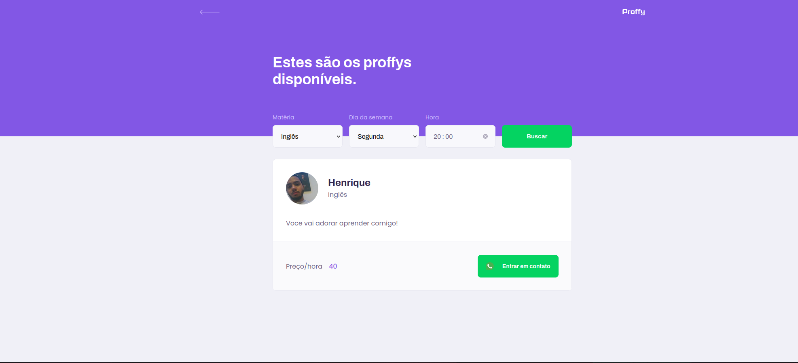

# Proffy

O Proffy é uma plataforma para conectar pessoas que queiram ofertar aulas e os alunos interessados em obter conhecimento.

## Novos aprendizados

 - Estilização de listas e comportamentos do Scroll View no React Native

## Instruções para rodar

```
yarn 
```
Nos diretórios para baixar as dependências.
```
yarn start
```
Para subir a API e Front em ```localhost:3000```.

Para rodar o Mobile, pode se utilizar o Expo ou um emulador de sua preferencia.

Com Expo:
```
yarn start
```
Acessar ```localhost:1902``` e ler o QRCode.

Rodar em um emulador android:
```
react-native run-android emulator-5544
```
```
react-native start
```

### Telas
<p align="center">
    
    
    
    
    
    
    
</p>